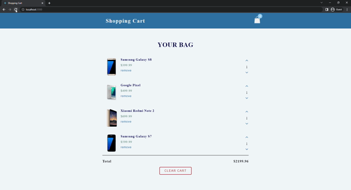

# Shopping Cart
In this project, the products in the basket are listed. The number of products can decrease or increase. Also, when changed the number of products the total price is changed. Together with the number of products increasing or decreasing, the number is changed on the basket icon too. When clicking on the "Clear Cart" button, all products are deleted. If you click on the remove button, this product is removed from the list.



## Used Technologies
* 

* 

* 

## Installation
First clone the project.
```
git clone https://github.com/saglamburcu/react-shopping-cart.git
```

## Usage
After cloning the project, open it in Visual Studio Code.
```
cd react-shopping-cart
code .
```
Download node modules to make it work
```
npm install
```
To make it work
```
npm start
```